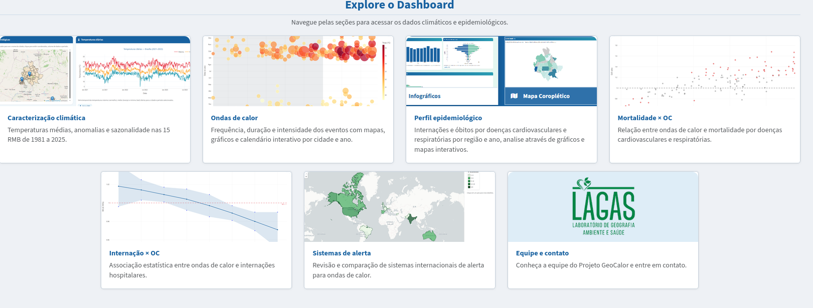

[Acessar o dashboard GeoCalor](https://geocalor.icict.fiocruz.br/){.btn .btn-primary}

O projeto **GeoCalor** investiga os impactos das **ondas de calor**, integrando dados climáticos e de saúde. O foco são as três regiões metropolitanas mais populosas de cada região do Brasil.

O dashboard reúne dados de **caracterização climática**, **ondas de calor**, **perfil epidemiológico** e **sistemas de alerta**. Com ele dá para visualizar padrões, identificar anomalias e apoiar o monitoramento, a comunicação de risco e o planejamento de ações em saúde. O objetivo é gerar evidências científicas e subsidiar a atuação do Sistema Único de Saúde (SUS).

## O que o dashboard mostra

| Seção | Conteúdo |
|---|---|
| Caracterização climática | temperaturas médias, anomalias e sazonalidade nas 15 regiões metropolitanas, de 1981 a 2025 |
| Ondas de calor | frequência, duração e intensidade dos eventos, com mapas, gráficos e calendário por cidade e ano |
| Perfil epidemiológico | internações e óbitos por doenças cardiovasculares e respiratórias, por região e ano |
| Mortalidade × ondas de calor | relação entre ondas de calor e mortalidade por doenças cardiovasculares e respiratórias |
| Internação × ondas de calor | associação estatística entre ondas de calor e internações hospitalares |
| Sistemas de alerta | revisão e comparação de sistemas internacionais de alerta para ondas de calor |

Projeto do **Laboratório de Geografia, Ambiente e Saúde (LAGAS/UnB)**, publicado pelo ICICT/Fiocruz.
