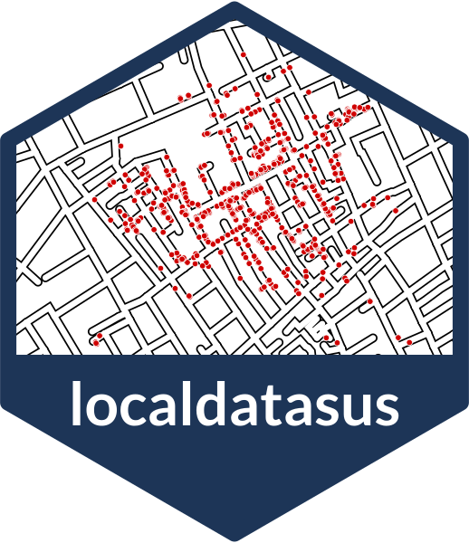
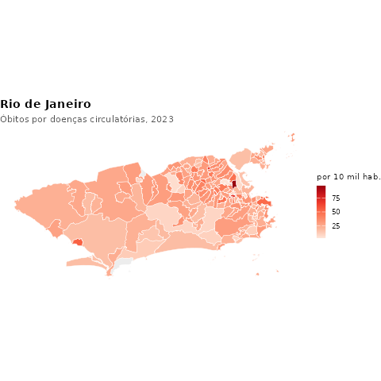
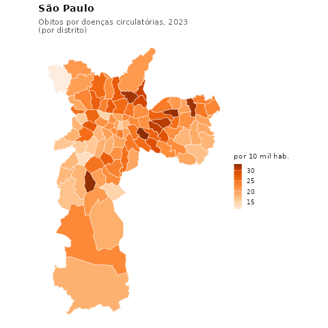
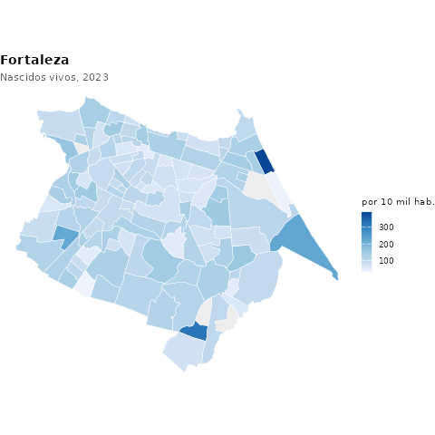
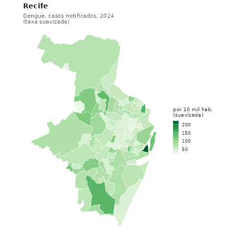
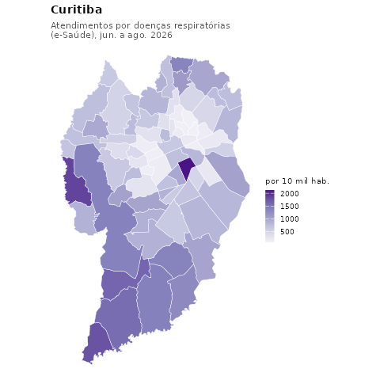
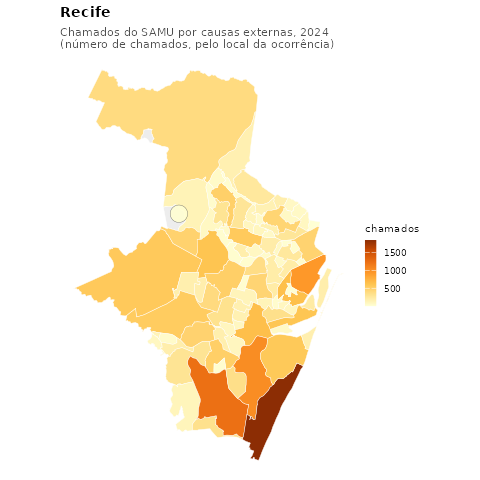

{width=160 fig-align="right"}

O [microdatasus](https://github.com/rfsaldanha/microdatasus) traz os dados do SUS por **município**. O **localdatasus** desce ao **bairro**. Ele junta quatro tipos de fonte:

- **microdados com CEP do paciente:** internações (SIH) e APACs de quimioterapia, radioterapia, diálise e outras;
- **arquivos das secretarias estaduais:** por exemplo, os nascidos vivos do RJ, com CEP e bairro da mãe;
- **TabNets das prefeituras e dos estados** que tabulam por bairro: Rio de Janeiro, São Paulo, Fortaleza e Santa Catarina;
- **portais de dados abertos**: arboviroses e SAMU do Recife, atendimentos médicos da rede municipal de Curitiba (e-Saúde) e o cadastro nacional de estabelecimentos (CNES).

Cada bairro é ligado ao **bairro oficial do IBGE**, com população do Censo 2022, taxa por 10 mil habitantes e coordenadas.

```r
library(localdatasus)

obitos_bairro("Rio de Janeiro", 2023, cid = "I")       # óbitos por doenças circulatórias
agravos_bairro("dengue", "Joinville", 2024)            # casos de dengue
obitos_bairro("Fortaleza", 2023)                       # TabNet de Fortaleza
estabelecimentos_bairro("Recife", tipo = "hospital")   # CNES, qualquer município
mapa_bairro(obitos_bairro("São Paulo", 2023))          # mapa pronto
```

## Mapas por bairro

Cada tabela vira um mapa com uma linha, `mapa_bairro()`, sobre os contornos oficiais de bairros e distritos do IBGE. Taxas por 10 mil habitantes:

::: {layout-ncol=3}











:::

## Instalar



```r
install.packages("remotes")
remotes::install_github("Hendesson/localdatasus")
```

[Documentação e tutoriais](https://hendesson.github.io/localdatasus/){.btn .btn-primary} [Código no GitHub](https://github.com/Hendesson/localdatasus){.btn .btn-outline-primary} [Relatar um problema](https://github.com/Hendesson/localdatasus/issues){.btn .btn-outline-primary} [Tirar uma dúvida](../../perguntas.qmd){.btn .btn-outline-primary}

## Como citar



No R: `citation("localdatasus")`.

## Novidades



## O que dá para fazer

| Função | O que faz |
|---|---|
| `onde_tem_bairro()` | lista os dados que existem, onde e para quais anos |
| `obitos_bairro()` | óbitos por bairro, causa (CID) e ano |
| `nascimentos_bairro()` | nascidos vivos por bairro |
| `agravos_bairro()` | dengue, tuberculose, sífilis, violência... |
| `internacoes_bairro()` | internações do SUS, pelo CEP do paciente |
| `atendimentos_bairro()` | atendimentos médicos da rede municipal de Curitiba (e-Saúde), com CID |
| `samu_bairro()` | chamados do SAMU 192 do Recife e região metropolitana, pelo local da ocorrência |
| `estabelecimentos_bairro()` | estabelecimentos de saúde (CNES) por bairro, em qualquer município |
| `mapa_bairro()`, `mapa_interativo()` | mapas estáticos e interativos |
| `ajuda()` | explica cada código de erro |
