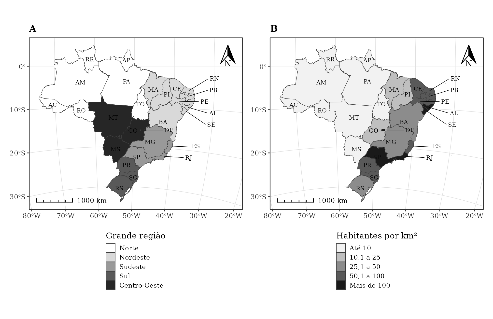

Muitas revistas cobram para imprimir figuras coloridas, e muitas pessoas leem artigos impressos ou em telas sem cor. Um mapa pensado em tons de cinza funciona em qualquer situação. Neste tutorial, você vai fazer, só com o R, a figura abaixo: dois mapas do Brasil lado a lado, com os elementos que um mapa de artigo científico costuma ter.



O que faz este mapa parecer "de artigo":

- **Tons de cinza com poucas classes** (até 5), fáceis de distinguir no papel.
- **Moldura com coordenadas** (latitude e longitude) e grade discreta.
- **Escala gráfica** e **rosa dos ventos** (indicação do norte).
- **Fonte serifada**, como a do texto do artigo.
- **Rótulos legíveis**: as UFs pequenas ficam fora do mapa, com uma linha de chamada.
- **Vários mapas numa só figura**, identificados por letras (A, B), o que economiza o número de ilustrações.

Todo o código usa dados abertos do IBGE, baixados direto da internet. Copie os blocos na ordem, em um mesmo script.

## 1. Pacotes

Instale uma vez:

```r
install.packages(c("sf", "ggplot2", "ggspatial", "ggrepel", "patchwork", "jsonlite"))
```

Depois, carregue:

```r
# Pacotes ------------------------------------------------------------------
library(sf)          # dados espaciais
library(ggplot2)     # gráficos
library(ggspatial)   # escala gráfica e rosa dos ventos
library(ggrepel)     # rótulos que não se sobrepõem
library(patchwork)   # juntar mapas numa figura
library(jsonlite)    # ler a API do IBGE
```

## 2. A malha das Unidades da Federação

A [API de malhas do IBGE](https://servicodados.ibge.gov.br/api/docs/malhas) devolve os contornos em GeoJSON, que o `sf` lê direto pela URL. Em seguida, os códigos das UFs viram siglas e o mapa é projetado na **Policônica do Brasil (EPSG:5880)**, que mede distâncias em metros. Isso é necessário para a escala gráfica.

```r
# 1. Malha das UFs (API de malhas do IBGE) ----------------------------------
url_malha <- paste0("https://servicodados.ibge.gov.br/api/v3/malhas/paises/BR",
                    "?intrarregiao=UF&formato=application/vnd.geo+json")
br <- st_read(url_malha, quiet = TRUE)

siglas <- c("11"="RO","12"="AC","13"="AM","14"="RR","15"="PA","16"="AP","17"="TO",
            "21"="MA","22"="PI","23"="CE","24"="RN","25"="PB","26"="PE","27"="AL",
            "28"="SE","29"="BA","31"="MG","32"="ES","33"="RJ","35"="SP","41"="PR",
            "42"="SC","43"="RS","50"="MS","51"="MT","52"="GO","53"="DF")
br$uf <- siglas[as.character(br$codarea)]
br <- st_transform(br, 5880)   # SIRGAS 2000 / Brazil Polyconic
```

## 3. Os dados

Para o painel A, a grande região sai do primeiro dígito do código da UF. Para o painel B, a densidade demográfica do Censo 2022 vem da [API de agregados do IBGE](https://servicodados.ibge.gov.br/api/docs/agregados) (tabela 4714, variável 614).

A densidade é transformada em **classes** com `cut()`. Escolha limites "redondos", fáceis de ler na legenda, e no máximo 5 classes: mais do que isso, os tons de cinza ficam parecidos demais.

```r
# 2. Dados: grande região e densidade demográfica (Censo 2022) --------------
regioes <- c("1" = "Norte", "2" = "Nordeste", "3" = "Sudeste", "4" = "Sul", "5" = "Centro-Oeste")
br$regiao <- factor(regioes[substr(br$codarea, 1, 1)], levels = regioes)

api <- paste0("https://servicodados.ibge.gov.br/api/v3/agregados/4714/periodos/2022/",
              "variaveis/614?localidades=N3[all]")
res <- fromJSON(api)$resultados[[1]]$series[[1]]
dens <- data.frame(codarea = res$localidade$id, densidade = as.numeric(res$serie$`2022`))
br <- merge(br, dens, by = "codarea")

# Classes (no máximo 5 tons de cinza se distinguem bem na impressão)
br$classe <- cut(br$densidade, breaks = c(0, 10, 25, 50, 100, Inf),
                 labels = c("Até 10", "10,1 a 25", "25,1 a 50", "50,1 a 100", "Mais de 100"))
```

## 4. Rótulos sem sobreposição

UFs pequenas (como DF, SE e AL) não têm espaço para a sigla. Elas recebem o rótulo fora do mapa, à direita, ligado por uma linha. Isso é feito com `geom_text_repel()` do pacote ggrepel. O argumento `seed` fixa a posição dos rótulos, para a figura sair igual toda vez.

```r
# 3. Rótulos: UFs pequenas ficam fora do mapa, com linha de chamada --------
pontos <- st_point_on_surface(br)
xy <- cbind(st_drop_geometry(pontos)["uf"], st_coordinates(pontos))
pequenas <- c("RN", "PB", "PE", "AL", "SE", "DF", "ES", "RJ")

rotulos <- list(
  geom_text(data = subset(xy, !uf %in% pequenas), aes(X, Y, label = uf),
            size = 2, family = "serif"),
  geom_text_repel(data = subset(xy, uf %in% pequenas), aes(X, Y, label = uf),
                  size = 2, family = "serif", nudge_x = 6e5, direction = "y",
                  hjust = 0, segment.size = 0.2, min.segment.length = 0, seed = 1)
)
```

## 5. Escala, norte e moldura

O pacote ggspatial desenha a escala gráfica (`annotation_scale`) e a rosa dos ventos (`annotation_north_arrow`). Em `coord_sf()`:

- `datum = 4326` faz a moldura mostrar latitude e longitude em graus;
- `xlim` alarga o mapa à direita, para caber os rótulos das UFs pequenas;
- `clip = "off"` impede que esses rótulos sejam cortados.

```r
# 4. Elementos cartográficos: escala, norte e moldura com coordenadas -------
cartografia <- list(
  annotation_scale(location = "bl", width_hint = 0.25, style = "ticks",
                   text_family = "serif", text_cex = 0.55, height = unit(0.12, "cm")),
  annotation_north_arrow(location = "tr", height = unit(0.7, "cm"), width = unit(0.5, "cm"),
                         style = north_arrow_orienteering(text_family = "serif", text_size = 6)),
  coord_sf(crs = 5880, datum = 4326, clip = "off",
           xlim = c(st_bbox(br)$xmin, st_bbox(br)$xmax + 6e5))
)
```

## 6. O tema

`theme_bw()` dá o fundo branco e a moldura. O resto é ajuste fino: grade cinza-clara e fina, fonte serifada e legenda embaixo, com uma borda em cada quadradinho. Sem essa borda, o branco da primeira classe some no fundo da página.

```r
# 5. Tema acadêmico: fundo branco, moldura, grade discreta, fonte serifada --
tema <- theme_bw(base_family = "serif", base_size = 8) +
  theme(legend.position = "bottom", legend.direction = "vertical",
        legend.key = element_rect(colour = "grey20", linewidth = 0.2),
        legend.key.size = unit(0.32, "cm"),
        panel.grid = element_line(colour = "grey88", linewidth = 0.2),
        axis.title = element_blank(),
        axis.text = element_text(size = 6.5, colour = "grey20"),
        plot.title = element_text(size = 9, face = "bold"))
```

## 7. Os mapas

As cores são definidas à mão com `scale_fill_manual()`, do mais claro ao mais escuro. Use `"white"` ou `"grey95"` para a classe mais baixa e `"grey10"` ou `"grey15"` para a mais alta. As fronteiras ficam em cinza-escuro e finas (`linewidth = 0.15`).

```r
# 6. Os dois mapas ------------------------------------------------------------
a <- ggplot(br) +
  geom_sf(aes(fill = regiao), colour = "grey25", linewidth = 0.15) +
  rotulos + cartografia +
  scale_fill_manual(values = c("white", "grey85", "grey60", "grey35", "grey15"),
                    name = "Grande região") +
  labs(title = "A") + tema

b <- ggplot(br) +
  geom_sf(aes(fill = classe), colour = "grey25", linewidth = 0.15) +
  rotulos + cartografia +
  scale_fill_manual(values = c("grey95", "grey75", "grey55", "grey35", "grey10"),
                    name = "Habitantes por km²") +
  labs(title = "B") + tema
```

::: {.callout-tip}
## Dados por categoria
Em dados com ordem (como a densidade), clareie para os valores baixos e escureça para os altos. Em categorias sem ordem (como as regiões), os tons de cinza sugerem uma hierarquia que não existe. Prefira poucas categorias, rótulos no próprio mapa ou hachuras (pacote [ggpattern](https://coolbutuseless.github.io/package/ggpattern/)).
:::

## 8. Juntar e salvar

Com o patchwork, `a + b` coloca os mapas lado a lado; `a / b` empilha um sobre o outro. Salve com as dimensões da página da revista: em geral, **17 cm** de largura para uma página inteira e **8 cm** para uma coluna. A resolução deve ser de **300 dpi** (ou mais, se a revista pedir). O PDF (ou SVG) é vetorial e não perde qualidade ao ampliar.

```r
# 7. Juntar e salvar na largura de uma página (17 cm) -------------------------
figura <- a + b
ggsave("mapa_pb.png", figura, width = 17, height = 11, units = "cm", dpi = 300, bg = "white")
ggsave("mapa_pb.pdf", figura, width = 17, height = 11, units = "cm")
```

## Dicas finais

- **Confira em escala de cinza de verdade**: imprima ou converta a imagem para tons de cinza e veja se as classes ainda se distinguem.
- **Título fora do mapa**: em artigos, o título e a fonte dos dados ficam na legenda da figura, no texto, e não dentro da imagem.
- **Mesma escala nos painéis**: se dois mapas mostram a mesma variável (por exemplo, dois anos), use as mesmas classes nos dois, para que a comparação seja justa.
- **Bairros e municípios**: o mesmo código serve para qualquer malha. Com o pacote [localdatasus](https://hendesson.github.io/localdatasus/), `mapa_bairro()` devolve um gráfico do ggplot2, e você pode somar a ele o mesmo tema, a escala, o norte e uma escala de cinza (por exemplo, `scale_fill_binned(low = "grey95", high = "grey10")`).
